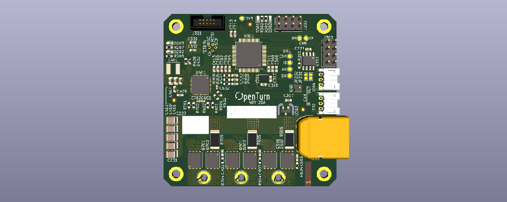

# OpenTurn BSP

## Overview

OpenTurn BLDC Motor Controller using Infineon PSoC 6 (CY8C6244AZI-S4D92), Infineon 6EDL7141 3 phase smart gate driver and Infineon TLE5012 angular hall sensor.

To use code from the BSP, simply include a reference to `cybsp.h`.

## Features

### Board Features:

The board features:
* Infineon PSoC62x4 MCU
* Infineon 6EDL7141 3 Phase Smart Gate Driver
* Infineon TLE5012 Hall Angle Sensor
* onboard temperature sensors
* TI CANFD Transceiver TCAN33x
* Option for external encoder

BLDC Motor Controller Specs:
* Peak Current          
* Constant Current      
* Supply Voltage        12V - 48V
* Encoder Resolution    16bit
* Communications        CANFD, UART, I2C

### PSoC Features:

* 150MHz CM4F, 100MHz CM0
* 256kiB Flash
* 128kiB RAM
* Two 12-bit 2MSps ADCs
* Motor Control PWMs

### 6EDL7141 Features:

* 5.5 V to 60 V operating supply voltage (recommended operating condition)
* 1.5 A sink/ 1.5 A source peak gate driver currents
* Programmable driving voltage (7 V, 10 V, 12 V, 15 V)
* Protection Features: OCP, OVLO, UVLO, OTP

### TLE5012 Features:

* Giant Magneto Resistance (GMR)-based principle
* 16bit angle resolution
* Bi-directional SSC Interface up to 8 Mbit/s

## BSP Configuration
### Clock Configuration:

| Clock    | Source    | Output Frequency |
|----------|-----------|------------------|
| FLL      | IMO       | 100.0 MHz        |
| PLL      | IMO       | 100.0 MHz        |
| CLK_HF0  | CLK_PATH0 | 100 MHz          |
| CLK_HF1  | CLK_PATH0 | 100 MHz          |
| CLK_HF2  | CLK_PATH0 | 100 MHz          |
| CLK_HF3  | CLK_PATH0 | 100 MHz          |
| CLK_CM4  | CLK_PATH0 | 100 MHz          |
| CLK_CM0P | CLK_CM4   | 100 MHz          |
| CLK_PERI | CLK_CM0P  | 100 MHz          |

### Power Configuration:

* System Active Power Mode: LP
* VDDA Voltage: 3300 mV
* VDDD Voltage: 3300 mV

### Peripheral Configuration:

TCPWMs
| instance  | function  | description              |
|-----------|-----------|--------------------------|
| TCPWM0.0  | -         |                          |
| TCPWM0.1  | -         |                          |
| TCPWM0.2  | ENCODER1  | Quadrature Encoder 1     |
| TCPWM0.3  | ENCODER2  | Quadrature Encoder 1     |
| TCPWM1.0  | PWM AZ    | Gate Driver Auto Zero    |
| TCPWM1.1  | -         |                          |
| TCPWM1.2  | PWM B     | PWM for Phase B FETs     |
| TCPWM1.3  | PWM C     | PWM for Phase C FETs     |
| TCPWM1.4  | PWM A     | PWM for Phase A FETs     |
| TCPWM1.5  | -         |                          |
| TCPWM1.6  | PWM LED   | opt. PWM for user LEDs   |
| TCPWM1.7  | -         |                          |

SCBs
| instance | function  | description              |
|----------|-----------|--------------------------|
| SCB0     | (UART)    | opt. UART ENCODER con.   |
| SCB1     | SPI       | ENCODER SSC              |
| SCB2     | UART      | Debug UART               |
| SCB4     | SPI       | Gate Driver SPI          |
| SCB5     | (UART)    | opt. UART over CAN       |
| SCB6     | (I2C)     | opt. I2C slave over J301 |

GPIOs
| Pin   | I/O/A | peripheral | description              |
|-------|-------|------------|--------------------------|
| P0.0  | I     | TCPWM0.2   | Encoder 1 B              |
| P0.1  | I     | TCPWM0.2   | Encoder 1 A              |
| P0.2  | I     | TCPWM0.2   | Encoder 1 I              |
| P0.3  | I     | TCPWM0.3   | Encoder 2 I              |
| P0.4  | I     | TCPWM0.3   | Encoder 2 B              |
| P0.5  | I     | TCPWM0.3   | Encoder 2 A              |
| P2.0  | O     | SCB1       | SSC Data Output          |
| P2.1  | I     | SCB1       | SSC Data Input           |
| P2.2  | O     | SCB1       | SSC Clock                |
| P2.3  | O     | SCB1       | SSC CS Encoder 1         |
| P2.4  | O     | SCB1       | SSC CS Encoder 2         |
| P2.5  | O     | GPIO       | CANFD SILENT             |
| P2.6  | O     | GPIO       | STATUS_LED0              |
| P2.7  | O     | GPIO       | STATUS_LED1              |
| P3.0  | I     | SCB2       | DEBUG UART RX            |
| P3.1  | O     | SCB2       | DEBUG UART TX            |
| P5.0  | I     | CANFD0     | CANFD RX                 |
| P5.1  | O     | CANFD0     | CANFD TX                 |
| P5.6  | IO    | GPIO       | GPIO2                    |
| P5.7  | IO    | GPIO       | GPIO3                    |
| P6.2  | O     | TCPWM1.3   | PWM Phace C (Low)        |
| P6.3  | O     | TCPWM1.3   | PWM Phace C (High)       |
| P6.4  | O     | SWD/JTAG   | SWO                      |
| P6.5  | I     | JTAG       | TDI                      |
| P6.6  | IO    | SWD/JTAG   | SWDIO                    |
| P6.7  | I     | SWD/JTAG   | SWCLK                    |
| P7.0  | O     | SCB4       | Gate Driver SPI MOSI     |
| P7.1  | I     | SCB4       | Gate Driver SPI MISO     |
| P7.2  | O     | SCB4       | Gate Driver SPI SCK      |
| P7.3  | O     | SCB4       | Gate Driver SPI CS       |
| P8.0  | O     | TCPWM1.2   | PWM Phace B (Low)        |
| P8.1  | O     | TCPWM1.2   | PWM Phace B (High)       |
| P9.0  | O     | GPIO       | Gate Driver Enable       |
| P9.1  | I     | SmartIO    | Gate Driver Fault inv.   |
| P9.2  | A     | OpAmp      | Gate Driver Vref opt.    |
| P9.3  | O     | GPIO       | Gate Driver Brake signal |
| P9.4  | O     | TCPWM1.0   | Gate Driver Auto Zero    |
| P9.5  | I     | SmartIO    | CANFD Fault              |
| P10.0 | -     |            |                          |
| P10.1 | A     | ADC0/1     | Phase Current C          |
| P10.2 | A     | ADC0/1     | Phase Current B          |
| P10.3 | A     | ADC0/1     | Phase Current A          |
| P10.4 | A     | ADC0/1     | Bus Voltage              |
| P10.5 | A     | ADC0/1     | Bus Temperature          |
| P10.6 | IOA   | GPIO       | GPIO0                    |
| P10.7 | IOA   | GPIO       | GPIO1                    |
| P11.2 | -     |            |                          |
| P11.3 | -     |            |                          |
| P11.4 | O     | TCPWM1.4   | PWM Phace A (Low)        |
| P11.5 | O     | TCPWM1.4   | PWM Phace A (High)       |
| P11.6 | -     |            |                          |
| P11.7 | -     |            |                          |
| P12.6 | I     | ECO        | ECO IN                   |
| P12.7 | O     | ECO        | ECO OUT                  |

## API Reference Manual

The CY8CKIT-062-BLE Board Support Package provides a set of APIs to configure, initialize and use the board resources.